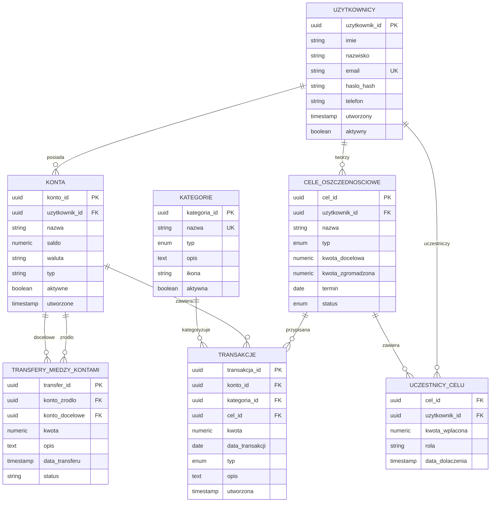

# Projekt Bazy Danych - Aplikacja do Zarządzania Budżetem Domowym

**Wersja:** 2.0 (Koncepcyjna)  
**Data:** Maj 2026  
**SGBD:** PostgreSQL  
**Norma:** Trzecia Postać Normalna (3NF)

---

## 1. Wstęp i Cele Projektowe

Niniejszy dokument opisuje **architekturę logiczną** bazy danych dla systemu zarządzania budżetem domowym. Fokus położony jest na spełnianiu wymagań biznesowych i funkcjonalnych poprzez odpowiednią strukturalizację danych i logiki transakcyjnej.

### 1.1 Główne Cele Projektowe

- **BR-01**: Pełna kontrola nad finansami - możliwość rejestracji każdej operacji finansowej
- **BR-02**: Świadome planowanie - mechanizm celów oszczędnościowych
- **BR-03**: Transparentne podsumowania - raporty miesięczne i roczne
- **BR-04**: Spójność rachunkowa - saldo zawsze zsynchronizowane z historią
- **BR-05**: Wspólne oszczędzanie - cele rodzinne z śledzeniem udziałów

### 1.2 Podejście Architektoniczne

Projekt opiera się na trzech filarach:

1. **Normalizacja danych (3NF)** - eliminacja redundancji, spójność referencyjna
2. **Automatyzacja logiki (Triggery)** - salda aktualizują się automatycznie, zapobieganie błędom
3. **Bezpieczeństwo ACID** - transfery i operacje finansowe są atomowe

---

## 2. Diagram ERD (Entity-Relationship Diagram)

### Wizualizacja Struktury

Poniżej diagram pokazujący **relacje między encjami** i ich **zależności**:

> Otwórz `schema.dbml` i kliknij "Preview DBML" aby zobaczyć interaktywny diagram!

---

## 3. Struktura Logiczna Bazy

### 3.1 Encje Główne

#### **Uzytkownicy**
- **Cel**: Centralny punkt - każda operacja finansowa należy do użytkownika
- **Spełnia FR-1.1**: Przechowywanie unikalnych profili (email, imię, nazwisko)
- **Notatka**: UUID zamiast sekwencyjnego ID dla bezpieczeństwa i dystrybucji
- **Indeksowanie**: Email (wyszukiwanie logowania), status aktywności

#### **Kategorie** 
- **Cel**: Słownik - wszystkie transakcje muszą być kategoryzowane
- **Spełnia FR-2.1**: Podział na PRZYCHOD/WYDATEK zapewnia segregację danych
- **Architektura**: Słownik danych zmiennie wartościowanych - niezmienniki dla spójności
- **Ochrona**: Nie można usunąć kategorii z historyczną transakcjami (trigger RESTRICT)

#### **Konta**
- **Cel**: Spełnia FR-1.2 - użytkownik może mieć wiele kont (gotówka, oszczędności, karty)
- **Saldo**: Jedyne źródło prawdy dla stanu finansów (aktualizowane przez triggery)
- **Waluta**: Obsługuje wielowalutowość (domyślnie PLN)
- **Kaskada**: Usunięcie użytkownika kasuje jego konta (logiczna konsekwencja)

#### **Cele_Oszczednosciowe**
- **Cel**: Spełnia BR-02 i FR-3.1/FR-3.3 - indywidualne i rodzinne cele
- **Typ**: Enum (INDYWIDUALNY/RODZINNY) - różne reguły przetwarzania
- **Kwota_zgromadzona**: Aktualizowana automatycznie przez triggery (FR-3.2/3.4)
- **Status**: Umożliwia śledzenie postępu (AKTYWNY → OSIAGNIETY → ANULOWANY)

#### **Uczestnicy_Celu** (Tabela Asocjacyjna)
- **Cel**: Spełnia FR-3.4 - relacja M:N między użytkownikami i celami rodzinnymi
- **3NF Compliance**: Eliminuje redundancję - każdy uczestnik raz na cel
- **Kwota_wplacona**: Śledzenie indywidualnego wkładu każdego członka rodziny
- **Klucz główny**: (cel_id, uzytkownik_id) - gwarantuje unikalność

#### **Transakcje**
- **Cel**: Spełnia FR-2.2 i BR-01 - centralna historia wszystkich operacji finansowych
- **Integralność**: Lączenie z Kontami (RESTRICT) - zapobiega usunięciu konta z historią
- **Przypisanie do celu**: Opcjonalne (nullable) - transakcja może nie być powiązana z celem
- **Typ**: PRZYCHOD/WYDATEK/TRANSFER - różne logiki przetwarzania

#### **Transfery_Miedzy_Kontami** (Audyt)
- **Cel**: Spełnia NFR-2.1 - audyt transferów między kontami
- **Niezależna tabela**: Pozwala na historię transferów bez mieszania z innymi transakcjami
- **Status**: Umożliwia śledzenie stanu operacji (dla przyszłych rozszerzeń asynchronicznych)

---

## 4. Mechanizmy Automatyzacji - Triggery

### Koncepcja: Automatyczna Synchronizacja Danych

Zamiast ręcznej aktualizacji sald i celów, system używa **triggerów (funkcji wyzwalajaćych)** do automatyzacji:

### 4.1 Synchronizacja Salda Konta

**Problem**: Po dodaniu transakcji saldo konta musi być natychmiast zaktualizowane
- **Rozwiązanie**: Trigger wyzwalany po INSERT transakcji → automatycznie UPDATE saldo w tabeli Konta
- **Reguła**: PRZYCHOD (+), WYDATEK (-)
- **Efekt**: Spełnia BR-04 (spójność rachunkowa) i FR-2.3

**Gwarancje**:
- Saldo zawsze zgadza się z historią transakcji
- Niemożliwe ręczne zabrudzenie salda
- Eliminuje ryzyko błędów ręcznych operacji

### 4.2 Propagacja do Celów Oszczędnościowych

**Problem**: Cel musi śledzić zgromadzoną kwotę i udział każdego uczestnika
- **Rozwiązanie**: Po INSERT transakcji przypisanej do celu → UPDATE kwota_zgromadzona w Cele_Oszczednosciowe
- **Dodatkowo**: Dla celów rodzinnych → UPDATE kwota_wplacona w Uczestnicy_Celu
- **Efekt**: Spełnia FR-3.2 (indywidualne) i FR-3.4 (rodzinne)

**Architektura**:
- Cel zawsze ma dokładny stan finansów
- Każdy członek celu rodzinnego ma zarejestrowany swój wkład
- Umożliwia generowanie raportów postępu bez dodatkowych obliczeń

### 4.3 Ochrona Integralności - Kategorie

**Problem**: Nie można usunąć kategorii, które mają historyczne transakcje
- **Rozwiązanie**: Trigger sprawdzany przed DELETE kategorii - jeśli istnieją transakcje, operacja jest odrzucona
- **Efekt**: Spełnia FR-4.3 (ochrona spójności danych historycznych)

**Logika**: 
- Kategorie aktywne są zawsze dostępne
- Kategorie nieużywane można usunąć
- Historia nigdy nie zostaje „osierocona"

### 4.4 Audyt - Znaczniki Czasowe

**Problem**: Śledzenie kiedy dane zostały zmienione
- **Rozwiązanie**: Każdy UPDATE automatycznie aktualizuje pole `ostatnia_zmiana` do bieżącego czasu
- **Aplikacja**: Audit trail dla wszystkich tabel (użytkownicy, konta, cele, transakcje)

---

## 5. Procedury Składowane - Operacje Transakcyjne

### Koncepcja: Operacje Atomowe (All-or-Nothing)

Procedury zapewniają, że złożone operacje (np. transfer) są **atomowe** - albo całkowicie się wykonają, albo całkowicie się cofną.

### 5.1 Transfer Między Kontami (ACID)

**Problem**: Transferowanie pieniędzy z konta A do B musi być bezpieczne
- **Rozwiązanie**: Wewnątrz jednej transakcji bazy danych - zmniejsz saldo A, zwiększ saldo B, zarejestruj w historii
- **Gwarancje ACID**:
  - **Atomicity**: Albo oba salda się zmienią, albo żadne
  - **Consistency**: Historia transferów zawsze zgadza się z saldami
  - **Isolation**: Procedura blokuje obie konta - żaden inny transfer nie może się z nią interferować
  - **Durability**: Po zatwierdzeniu transfer jest trwały na dysku
- **Efekt**: Spełnia NFR-2.1 (bezpieczeństwo transakcji finansowych)

**Architektura**:
- Walidacja parametrów (kwota > 0, konta istniejące, rozłączne)
- Blokowanie pesymistyczne obu kont - zapobieganie race conditions
- Rollback (wycofanie) na błąd - spójność gwarantowana

### 5.2 Zarządzanie Celami Rodzinnymi

**Problem**: Dodawanie uczestnika do celu wymaga walidacji
- **Rozwiązanie**: Procedura sprawdzająca czy cel jest typu RODZINNY, czy użytkownik istnieje, czy nie ma duplikatów
- **Efekt**: Spełnia FR-3.3 (przypisywanie użytkowników do celów)

**Logika**:
- Tylko cele typu RODZINNY mogą mieć uczestników
- Każdy użytkownik może być tylko raz uczestnikiem danego celu
- Procedura rejestruje data_dolaczenia dla audytu

### 5.3 Raportowanie Finansowe

**Problem**: Obliczanie przychodu/wydatków za miesiąc wymaga agregacji danych
- **Rozwiązanie**: Procedura przesuwająca zakres dat, sumująca transakcje po typie
- **Efekt**: Spełnia BR-03 (raporty miesięczne/roczne)

**Optymalizacja**:
- Kwerenda filtruje po datach (indeksy wspomagają akcelerację)
- Możliwość cachowania wyników do przyszłych raportów
- Możliwość rozszerzenia o filtry per-kategoria

---

## 6. Widoki - Abstrakcje Danych

### Koncepcja: Uproszczone Interfejsy do Danych

Widoki (Views) ukrywają złożoność JOIN'ów i agregacji, prezentując dane w przystępnej formie.

### 6.1 Miesięczne Zestawienie Wydatków

**Cel**: Szybki przegląd wydatków per kategoria i miesiąc
- **Źródła**: Transakcje, Konta, Kategorie, Uzytkownicy
- **Agregacja**: Suma, liczba transakcji, średnia
- **Filtr**: Typ = WYDATEK
- **Zastosowanie**: Dashboards, raporty, analiza wydatków

**Spełnia**: FR-4.1 (podsumowania), BR-03 (transparentne raporty)

### 6.2 Postęp Celów Oszczędnościowych

**Cel**: Śledzenie realizacji celów z procentowym postępem
- **Obliczenie**: (kwota_zgromadzona / kwota_docelowa) * 100
- **Widoczność**: Status, termin, pozostałe dni
- **Filtr**: Wszystkie cele niezależnie od typu

**Spełnia**: BR-02 (świadome planowanie), FR-3.1 (monitorowanie postępu)

### 6.3 Statystyka Wpłat do Celów Rodzinnych

**Cel**: Przejrzystość udziałów członków w celach wspólnych
- **Obliczenie**: Procent wkładu każdego członka = kwota_wplacona / kwota_zgromadzona * 100
- **Widoczność**: Historia dołączenia, rola, kwota wpłacona
- **Filtr**: Tylko cele RODZINNE

**Spełnia**: FR-3.4 (śledzenie udziałów), NFR-1.3 (izolacja danych wspólnych)

### 6.4 Aktualne Salda Kont

**Cel**: Szybki przegląd stanu wszystkich kont użytkownika
- **Agregacja**: Suma przychodów, wydatków, liczba operacji
- **Widoczność**: Status konta, waluta, historia

**Spełnia**: FR-1.2 (zarządzanie wieloma kontami), FR-1.3 (śledzenie sald)

### 6.5 Historia Transferów

**Cel**: Audyt transferów między kontami z kontekstem użytkownika
- **Informacje**: Konto źródłowe, docelowe, kwota, data, status

**Spełnia**: NFR-2.1 (audyt), FR-4.1 (podsumowania)

---

## 7. Bezpieczeństwo i Kontrola Dostępu (RBAC)

### Architektura Ról

System definiuje **3 role** z rosnącymi uprawnieniami:

#### **db_admin** - Administrator
- Pełne uprawnienia do wszystkich tabel, procedur, funkcji
- Może modyfikować strukturę bazy
- Ustawienie ról i uprawnień dla innych użytkowników

#### **db_user** - Zwykły Użytkownik
- SELECT, INSERT, UPDATE na tabelach (bez DELETE - zapobieganie akcydentalnego usunięcia)
- Pełny dostęp do procedur (transfer, raportowanie)
- Widoki dla bezpiecznej agregacji danych

#### **db_auditor** - Audytor
- SELECT na wszystkich tabelach (tylko odczyt)
- Dostęp do historii i raportów
- Niemożliwe modyfikowanie danych

### Izolacja Danych

**Problem**: Użytkownik A nie powinien widzieć danych użytkownika B
- **Rozwiązanie**: Widoki mogą być rozszerzone o Row-Level Security (RLS) - filtrowanie na poziomie SGBD
- **Procedury**: Mogą validować czy użytkownik ma dostęp do danego zasobu
- **Aplikacja**: Walidacja po stronie aplikacji - wszystkie zapytania filtrują po `uzytkownik_id`

**Spełnia**: NFR-1.2 (izolacja logiczna), NFR-1.3 (cele rodzinne - dostęp ograniczony do uczestników)

---

## 8. Normalizacja i Projekt Logiczny

### Trzecia Postać Normalna (3NF) - Compliance

#### **Problem: Redundancja Danych**
- **Rozwiązanie**: Każda kategoria przechowywana raz w tabeli Kategorie
- **Efekt**: Zmiana nazwy kategorii aktualizuje się wszędzie automatycznie (poprzez Foreign Key)

#### **Problem: Anomalie Aktualizacji**
- **Rozwiązanie**: Saldo konta zależy TYLKO od konta (nie przechowywanego redundantnie w Transakcjach)
- **Triggerem**: Saldo zawsze synchronizowane z historią

#### **Problem: Anomalie Usunięcia**
- **Rozwiązanie**: Użytkownik i jego konta logicznie związane - usunięcie użytkownika kasuje konta (ON DELETE CASCADE)
- **Historia**: Transakcje RESTRICT - nigdy nie tracą powiązania z kontem/kategorią

#### **Problem: Relacja M:N**
- **Rozwiązanie**: Tabela asocjacyjna `Uczestnicy_Celu` normalizuje relację między Uzytkownicy i Cele_Oszczednosciowe
- **Efekt**: Unika powielania rekordów, pozwala na niezależne śledzenie każdej uczestnika

### Integracja Referencyjna (Foreign Keys)

| Relacja | Typ | Kaskada | Uzasadnienie |
|---------|-----|---------|---|
| Uzytkownicy → Konta | 1:N | CASCADE | Konto nielogiczne bez właściciela |
| Uzytkownicy → Cele | 1:N | CASCADE | Cel należy do użytkownika |
| Konta → Transakcje | 1:N | RESTRICT | Historia transakcji musi zostać zachowana |
| Kategorie → Transakcje | 1:N | RESTRICT | Kategorie są słownikiem - nie usuwamy |
| Cele → Transakcje | 1:N | SET NULL | Transakcja może zostać niezwiązana z celem |

**Spełnia**: NFR-3.2 (prawidłowe reguły FK)

---

## 9. Indeksowanie i Optymalizacja

### Strategia Indeksowania

#### **Indeksy na Klucze Obce** (dla JOIN'ów)
- Każde FK posiada indeks → akceleracja JOIN'ów w widokach i raportach
- **Przykłady**: uzytkownik_id, kategoria_id, cel_id
- **Efekt**: Raporty wykonują się szybko nawet przy dużej ilości danych

#### **Indeksy na Kolumny Filtrujące**
- Kolumny używane w WHERE → indeksowane dla szybkości
- **Przykłady**: email (logowanie), status (filtry), typ (kategoria)
- **Efekt**: Wyszukiwania (np. znalezienie użytkownika po emailu) są błyskawiczne

#### **Indeksy Złożone** (Multi-column)
- `(konto_id, data_transakcji)` → szybkie filtrowanie transakcji po koncie i dacie
- `(uzytkownik_id, aktywne)` → szybkie listowanie aktywnych kont użytkownika
- **Efekt**: Zapytania filtrujące po wielu kolumnach są zoptymalizowane

**Spełnia**: Wydajność systemu dla rosnącej liczby rekordów

---

## 10. Transakcyjność i Poziomy Izolacji

### ACID w Praktyce

#### **Atomicity** (Atomowość)
- **Procedury**: Transfer to jedna transakcja - zmieniają się oba salda lub żadne
- **Triggery**: Wpiętrzenie transakcji UPDATE - albo wszystko, albo nic
- **Gwarancja**: Nigdy nie będzie "pół-transferu" z brakującymi pieniędzmi

#### **Consistency** (Spójność)
- **Triggery**: Salda zawsze zsynchronizowane z historią
- **Ograniczenia CHECK**: Kwoty zawsze > 0, termin w przyszłości
- **FK**: Historia nigdy nie traci powiązania z źródłem
- **Gwarancja**: Baza zawsze w spójnym stanie

#### **Isolation** (Izolacja)
- **FOR UPDATE**: Blokowanie pesymistyczne w procedurach
- **Poziomy izolacji**: 
  - SERIALIZABLE - dla transferów (krytyczne operacje)
  - REPEATABLE READ - dla standardowych operacji
  - READ COMMITTED - dla raportów (mogą być trochę nieaktualne)
- **Gwarancja**: Współbieżne operacje nie interferują

#### **Durability** (Trwałość)
- **WAL** (Write-Ahead Logging): PostgreSQL zapisuje do logu przed modyfikacją danych
- **Flush to disk**: Po COMMIT dane na dysku
- **Gwarancja**: Nawet po awarii maszyny dane są bezpieczne

**Spełnia**: NFR-2.1, NFR-2.2 (ACID compliance)

---

## 11. Jak Projekt Spełnia Wymagania

### Wymagania Biznesowe (BR)

| BR | Opis | Jak Jest Spełnione |
|----|------|---|
| **BR-01** | Pełna kontrola nad finansami | Transakcje rejestrują każdą operację (PRZYCHOD/WYDATEK), historia nigdy nie jest usuwana |
| **BR-02** | Świadome planowanie wydatków | Cele oszczędnościowe z śledzeniem postępu (widok `v_postep_celow`) |
| **BR-03** | Przejrzyste podsumowania | Widoki agregujące dane per miesiąc/kategorię (`v_miesieczne_wydatki_kategorie`) |
| **BR-04** | Spójność rachunkowa | Triggery automatycznie synchronizują saldo z historią transakcji |
| **BR-05** | Wspólne oszczędzanie | Cele RODZINNY z tabelą `Uczestnicy_Celu` śledzącą udziały każdego członka |

### Wymagania Funkcjonalne (FR)

| FR | Opis | Implementacja |
|----|------|---|
| **FR-1.1** | Przechowywanie danych użytkowników | Tabela `Uzytkownicy` (email unikatowy) |
| **FR-1.2** | Wiele kont na użytkownika | 1:N relacja `Uzytkownicy → Konta` |
| **FR-1.3** | Saldo aktualizowane na bieżąco | Trigger wyzwalany po INSERT transakcji |
| **FR-2.1** | Słownik kategorii | Tabela `Kategorie` (typ: PRZYCHOD/WYDATEK) |
| **FR-2.2** | Dodawanie transakcji | Tabela `Transakcje` z FK do Kont i Kategorii |
| **FR-2.3** | AUTO-UPDATE saldo | Trigger po INSERT transakcji |
| **FR-3.1** | Indywidualne cele | `Cele_Oszczednosciowe` z typem INDYWIDUALNY |
| **FR-3.2** | AUTO-UPDATE celu | Trigger aktualizuje `kwota_zgromadzona` |
| **FR-3.3** | Cele rodzinne | `Cele_Oszczednosciowe` z typem RODZINNY |
| **FR-3.4** | Udziały w celach rodzinnych | Tabela `Uczestnicy_Celu` śledzący `kwota_wplacona` per użytkownika |
| **FR-4.1** | Widoki podsumowujące | 5 widoków (wydatki, postęp, statystyka, salda, historia) |
| **FR-4.2** | Transfer między kontami | Procedura `sp_transfer_miedzy_kontami` (atomowa) |
| **FR-4.3** | Ochrona kategorii | Trigger `tr_kategorie_prevent_delete` |

### Wymagania Niefunkcjonalne (NFR)

| NFR | Opis | Implementacja |
|----|------|---|
| **NFR-1.1** | 3 role (admin, user, auditor) | CREATE ROLE + GRANT uprawnienia |
| **NFR-1.2** | Izolacja danych między użytkownikami | Widoki mogą filtrować po `uzytkownik_id`, RLS (Row-Level Security) |
| **NFR-1.3** | Dostęp do wspólnych celów tylko dla członków | Procedura waliduje membership w `Uczestnicy_Celu` |
| **NFR-2.1** | Transakcje ACID | Procedury z BEGIN/EXCEPTION/COMMIT, FOR UPDATE |
| **NFR-2.2** | Poziomy izolacji | SERIALIZABLE/REPEATABLE READ/READ COMMITTED |
| **NFR-3.1** | 3NF Compliance | Eliminacja redundancji, tabela asocjacyjna, normalizacja |
| **NFR-3.2** | FK z prawidłowymi kaskadami | CASCADE dla właściciela-zasobu, RESTRICT dla historii |

---

## 12. Przebieg Implementacji

### Faza 1: Fundament Danych
- Utworzenie ENUM typów (status, typ kategorii itp)
- Tworzenie 7 tabel (bez triggery/procedur/widoków)
- Indeksowanie kluczy obcych i filtrów

### Faza 2: Automatyzacja i Logika
- Implementacja 4 triggerów (synchronizacja sald, ochrona integralności)
- Implementacja 3 procedur (transfer, raportowanie, zarządzanie)
- Testowanie atomowości i spójności ACID

### Faza 3: Warstwa Dostępu
- Tworzenie 5 widoków (abstrakcje danych)
- Konfiguracja RBAC (role i uprawnienia)
- Testy izolacji danych między użytkownikami

### Faza 4: Dane Testowe i Weryfikacja
- Wstawianie seed data (użytkownicy, kategorie, konta, cele, transakcje)
- Testy functjonalne: triggery, procedury, widoki
- Testy bezpieczeństwa: uprawnień, izolacji, ACID

---

## 13. Technologia i Standardy

| Element | Standard | Uzasadnienie |
|---------|----------|---|
| **SGBD** | PostgreSQL | Niezawodność, ACID compliance, wsparcie dla zaawansowanych typów (UUID, ENUM) |
| **Typy Danych** | UUID dla PK | Lepsze dla dystrybucji, bezpieczeństwo, NIE sekwencyjna |
| | NUMERIC(12,2) | Dokładna arytmetyka pieniądza (nie FLOAT) |
| | TIMESTAMP | Audyt z dokładnością do sekundy |
| **Konwencje** | snake_case | Kolumny i tabele (PostgreSQL best practice) |
| | PascalCase | Nazwy tabel (czytelność) |
| | Przedrostki | `v_` | Widoki, `tr_` | Triggery, `sp_` | Procedury |
| **Norma** | 3NF | Eliminacja redundancji, spójność, skalowanie |
| **ACID** | Pełna compliance | Transakcyjność gwarantowana na poziomie SGBD |

---

## 14. Przewodnik Po Diagramach i Artefaktach

Projekt zawiera następujące pliki:

- **`database_design.md`** (ten plik) - Opis koncepcyjny i architektura
- **`schema.dbml`** - Diagram DBML (otwórz w VS Code z DBML Previewer)
- **`schema.vuerd.json`** - Diagram ERD (interaktywny edytor - może być pusty)
- **`schema.erd`** - Alternatywny format ERD

Dla dokładnych skryptów SQL należy generować je z diagramów DBML lub z dokumentacji procedur.

---

## 15. Podsumowanie

Projekt bazy danych opiera się na:

✅ **Solidnych fundamentach** - Normalizacja 3NF, integracja referencyjna  
✅ **Automatyzacji** - Triggery synchronizują salda i cele  
✅ **Bezpieczeństwie** - ACID compliance, RBAC, izolacja danych  
✅ **Skalowaniu** - Indeksowanie, procedury atomowe, widoki  
✅ **Funkcjonalności** - Wszystkie wymagania (BR, FR, NFR) zostały uwzględnione  

Baza jest gotowa do implementacji w PostgreSQL i testowania w warunkach rzeczywistych.

---

**Koniec Dokumentu Projektowego**
