# Diagram ERD

## Spis treści

1. [Wprowadzenie](#wprowadzenie)
2. [Diagram ERD](#diagram-erd-1)
3. [Opis encji](#opis-encji)
   - [users](#users)
   - [households](#households)
   - [household_members](#household_members)
   - [categories](#categories)
   - [incomes](#incomes)
   - [expenses](#expenses)
   - [budgets](#budgets)
   - [reports](#reports)
   - [forecasts](#forecasts)
   - [savings_goals](#savings_goals)
   - [recurring_transactions](#recurring_transactions)
   - [budget_alerts](#budget_alerts)
4. [Opis relacji](#opis-relacji)
5. [Uwagi dotyczące klucza obcego samoreferującego](#uwagi-dotyczące-klucza-obcego-samoreferującego)

---

## Wprowadzenie

Niniejszy dokument przedstawia diagram związków encji (ERD — *Entity Relationship Diagram*) dla systemu zarządzania budżetem domowym. Model danych zaprojektowano w **trzeciej postaci normalnej (3NF)** i obejmuje on 12 tabel zgrupowanych w schemacie `budget`. System umożliwia zarządzanie gospodarstwami domowymi, śledzenie przychodów i wydatków, planowanie budżetów, generowanie raportów i prognoz, definiowanie celów oszczędnościowych, obsługę transakcji cyklicznych oraz alerty budżetowe.

---

## Diagram ERD

```mermaid
erDiagram
    users {
        SERIAL id PK
        VARCHAR email UK "NOT NULL, UNIQUE"
        VARCHAR password_hash "NOT NULL"
        VARCHAR display_name "NOT NULL"
        TIMESTAMPTZ created_at "DEFAULT NOW()"
    }

    households {
        SERIAL id PK
        VARCHAR name "NOT NULL"
        INT created_by FK "-> users.id"
        TIMESTAMPTZ created_at "DEFAULT NOW()"
    }

    household_members {
        SERIAL id PK
        INT household_id FK "-> households.id"
        INT user_id FK "-> users.id"
        VARCHAR role "CHECK (owner, member, viewer)"
        TIMESTAMPTZ joined_at "DEFAULT NOW()"
    }

    categories {
        SERIAL id PK
        INT household_id FK "-> households.id, NULL dla systemowych"
        VARCHAR name "NOT NULL"
        VARCHAR type "CHECK (income, expense)"
        INT parent_category_id FK "-> categories.id, NULL dla glownych"
        VARCHAR icon
        TIMESTAMPTZ created_at "DEFAULT NOW()"
    }

    incomes {
        SERIAL id PK
        INT household_id FK "-> households.id"
        INT user_id FK "-> users.id"
        INT category_id FK "-> categories.id"
        NUMERIC amount "CHECK > 0"
        TEXT description
        DATE income_date "NOT NULL"
        TIMESTAMPTZ created_at "DEFAULT NOW()"
    }

    expenses {
        SERIAL id PK
        INT household_id FK "-> households.id"
        INT user_id FK "-> users.id"
        INT category_id FK "-> categories.id"
        NUMERIC amount "CHECK > 0"
        TEXT description
        DATE expense_date "NOT NULL"
        TIMESTAMPTZ created_at "DEFAULT NOW()"
    }

    budgets {
        SERIAL id PK
        INT household_id FK "-> households.id"
        INT category_id FK "-> categories.id"
        INT month "CHECK 1-12"
        INT year "CHECK > 2000"
        NUMERIC planned_amount "CHECK > 0"
        TIMESTAMPTZ created_at "DEFAULT NOW()"
    }

    reports {
        SERIAL id PK
        INT household_id FK "-> households.id"
        DATE period_start "NOT NULL"
        DATE period_end "NOT NULL"
        NUMERIC total_income
        NUMERIC total_expense
        NUMERIC balance
        TIMESTAMPTZ generated_at "DEFAULT NOW()"
    }

    forecasts {
        SERIAL id PK
        INT household_id FK "-> households.id"
        INT category_id FK "-> categories.id"
        INT month
        INT year
        NUMERIC predicted_amount
        VARCHAR method "DEFAULT moving_average"
        TIMESTAMPTZ created_at "DEFAULT NOW()"
    }

    savings_goals {
        SERIAL id PK
        INT household_id FK "-> households.id"
        VARCHAR name "NOT NULL"
        NUMERIC target_amount "CHECK > 0"
        NUMERIC current_amount "DEFAULT 0, CHECK >= 0"
        DATE deadline
        VARCHAR status "DEFAULT active, CHECK (active, completed, cancelled)"
        TIMESTAMPTZ created_at "DEFAULT NOW()"
    }

    recurring_transactions {
        SERIAL id PK
        INT household_id FK "-> households.id"
        INT user_id FK "-> users.id"
        INT category_id FK "-> categories.id"
        VARCHAR type "CHECK (income, expense)"
        NUMERIC amount "CHECK > 0"
        TEXT description
        VARCHAR frequency "CHECK (daily, weekly, monthly, yearly)"
        DATE next_execution_date "NOT NULL"
        BOOLEAN is_active "DEFAULT TRUE"
        TIMESTAMPTZ created_at "DEFAULT NOW()"
    }

    budget_alerts {
        SERIAL id PK
        INT budget_id FK "-> budgets.id"
        NUMERIC threshold_percent "CHECK 0-100"
        BOOLEAN is_triggered "DEFAULT FALSE"
        TIMESTAMPTZ triggered_at
        TIMESTAMPTZ created_at "DEFAULT NOW()"
    }

    %% Relacje
    users ||--o{ household_members : "nalezy do"
    households ||--o{ household_members : "ma czlonkow"
    users ||--o{ households : "tworzy"
    households ||--o{ categories : "ma kategorie"
    categories ||--o| categories : "ma podkategorie"
    households ||--o{ incomes : "ma przychody"
    users ||--o{ incomes : "dodaje"
    categories ||--o{ incomes : "klasyfikuje"
    households ||--o{ expenses : "ma wydatki"
    users ||--o{ expenses : "dodaje"
    categories ||--o{ expenses : "klasyfikuje"
    households ||--o{ budgets : "planuje"
    categories ||--o{ budgets : "dla kategorii"
    households ||--o{ reports : "generuje"
    households ||--o{ forecasts : "prognozuje"
    categories ||--o{ forecasts : "dla kategorii"
    households ||--o{ savings_goals : "ma cele"
    households ||--o{ recurring_transactions : "ma cykliczne"
    users ||--o{ recurring_transactions : "definiuje"
    categories ||--o{ recurring_transactions : "klasyfikuje"
    budgets ||--o{ budget_alerts : "ma alerty"
```



---

## Opis encji

### users

Tabela przechowująca dane użytkowników systemu. Każdy użytkownik posiada unikalny adres e-mail oraz hasło przechowywane w formie skrótu kryptograficznego.

| Kolumna         | Typ              | Ograniczenia                | Opis                           |
|-----------------|------------------|-----------------------------|--------------------------------|
| `id`            | `SERIAL`         | `PRIMARY KEY`               | Unikalny identyfikator         |
| `email`         | `VARCHAR(255)`   | `UNIQUE`, `NOT NULL`        | Adres e-mail użytkownika       |
| `password_hash` | `VARCHAR(255)`   | `NOT NULL`                  | Skrót hasła                    |
| `display_name`  | `VARCHAR(100)`   | `NOT NULL`                  | Nazwa wyświetlana              |
| `created_at`    | `TIMESTAMPTZ`    | `DEFAULT NOW()`             | Data utworzenia konta           |

### households

Gospodarstwa domowe — centralna jednostka organizacyjna systemu. Każde gospodarstwo jest tworzone przez jednego użytkownika.

| Kolumna      | Typ            | Ograniczenia                | Opis                               |
|--------------|----------------|-----------------------------|-------------------------------------|
| `id`         | `SERIAL`       | `PRIMARY KEY`               | Unikalny identyfikator              |
| `name`       | `VARCHAR(100)` | `NOT NULL`                  | Nazwa gospodarstwa                  |
| `created_by` | `INT`          | `FOREIGN KEY -> users.id`   | Twórca gospodarstwa                 |
| `created_at` | `TIMESTAMPTZ`  | `DEFAULT NOW()`             | Data utworzenia                      |

### household_members

Tabela asocjacyjna łącząca użytkowników z gospodarstwami domowymi. Realizuje relację wiele-do-wielu z dodatkowym atrybutem roli.

| Kolumna        | Typ            | Ograniczenia                       | Opis                             |
|----------------|----------------|------------------------------------|----------------------------------|
| `id`           | `SERIAL`       | `PRIMARY KEY`                      | Unikalny identyfikator           |
| `household_id` | `INT`          | `FOREIGN KEY -> households.id`     | Gospodarstwo domowe              |
| `user_id`      | `INT`          | `FOREIGN KEY -> users.id`          | Użytkownik                       |
| `role`         | `VARCHAR(20)`  | `CHECK (owner, member, viewer)`    | Rola w gospodarstwie             |
| `joined_at`    | `TIMESTAMPTZ`  | `DEFAULT NOW()`                    | Data dołączenia                  |

> **Ograniczenie unikalne:** `UNIQUE (household_id, user_id)` — użytkownik może należeć do danego gospodarstwa tylko raz.

### categories

Kategorie finansowe do klasyfikacji przychodów i wydatków. Obsługuje hierarchię dzięki samoreferującemu kluczowi obcemu `parent_category_id`.

| Kolumna              | Typ            | Ograniczenia                          | Opis                                          |
|----------------------|----------------|---------------------------------------|-----------------------------------------------|
| `id`                 | `SERIAL`       | `PRIMARY KEY`                         | Unikalny identyfikator                        |
| `household_id`       | `INT`          | `FOREIGN KEY -> households.id`        | Gospodarstwo (NULL = kategoria systemowa)     |
| `name`               | `VARCHAR(100)` | `NOT NULL`                            | Nazwa kategorii                               |
| `type`               | `VARCHAR(10)`  | `CHECK (income, expense)`             | Typ: przychód lub wydatek                     |
| `parent_category_id` | `INT`          | `FOREIGN KEY -> categories.id`        | Kategoria nadrzędna (NULL = najwyższy poziom) |
| `icon`               | `VARCHAR(10)`  |                                       | Ikona (emoji)                                 |
| `created_at`         | `TIMESTAMPTZ`  | `DEFAULT NOW()`                       | Data utworzenia                                |

### incomes

Tabela rejestrująca przychody poszczególnych użytkowników w ramach gospodarstwa domowego.

| Kolumna        | Typ             | Ograniczenia                     | Opis                        |
|----------------|-----------------|----------------------------------|-----------------------------|
| `id`           | `SERIAL`        | `PRIMARY KEY`                    | Unikalny identyfikator      |
| `household_id` | `INT`           | `FOREIGN KEY -> households.id`   | Gospodarstwo domowe         |
| `user_id`      | `INT`           | `FOREIGN KEY -> users.id`        | Użytkownik dodający         |
| `category_id`  | `INT`           | `FOREIGN KEY -> categories.id`   | Kategoria przychodu         |
| `amount`       | `NUMERIC(12,2)` | `CHECK (amount > 0)`            | Kwota przychodu             |
| `description`  | `TEXT`          |                                  | Opis przychodu              |
| `income_date`  | `DATE`          | `NOT NULL`                       | Data przychodu              |
| `created_at`   | `TIMESTAMPTZ`   | `DEFAULT NOW()`                  | Data utworzenia rekordu      |

### expenses

Tabela rejestrująca wydatki poszczególnych użytkowników w ramach gospodarstwa domowego.

| Kolumna        | Typ             | Ograniczenia                     | Opis                        |
|----------------|-----------------|----------------------------------|-----------------------------|
| `id`           | `SERIAL`        | `PRIMARY KEY`                    | Unikalny identyfikator      |
| `household_id` | `INT`           | `FOREIGN KEY -> households.id`   | Gospodarstwo domowe         |
| `user_id`      | `INT`           | `FOREIGN KEY -> users.id`        | Użytkownik dodający         |
| `category_id`  | `INT`           | `FOREIGN KEY -> categories.id`   | Kategoria wydatku           |
| `amount`       | `NUMERIC(12,2)` | `CHECK (amount > 0)`            | Kwota wydatku               |
| `description`  | `TEXT`          |                                  | Opis wydatku                |
| `expense_date` | `DATE`          | `NOT NULL`                       | Data wydatku                |
| `created_at`   | `TIMESTAMPTZ`   | `DEFAULT NOW()`                  | Data utworzenia rekordu      |

### budgets

Planowane budżety przypisane do kategorii w danym miesiącu i roku. Pozwalają na kontrolowanie wydatków.

| Kolumna          | Typ             | Ograniczenia                     | Opis                        |
|------------------|-----------------|----------------------------------|-----------------------------|
| `id`             | `SERIAL`        | `PRIMARY KEY`                    | Unikalny identyfikator      |
| `household_id`   | `INT`           | `FOREIGN KEY -> households.id`   | Gospodarstwo domowe         |
| `category_id`    | `INT`           | `FOREIGN KEY -> categories.id`   | Kategoria budżetu           |
| `month`          | `INT`           | `CHECK (month BETWEEN 1 AND 12)` | Miesiąc                    |
| `year`           | `INT`           | `CHECK (year > 2000)`           | Rok                         |
| `planned_amount` | `NUMERIC(12,2)` | `CHECK (planned_amount > 0)`    | Kwota planowana             |
| `created_at`     | `TIMESTAMPTZ`   | `DEFAULT NOW()`                  | Data utworzenia rekordu      |

> **Ograniczenie unikalne:** `UNIQUE (household_id, category_id, month, year)` — jeden budżet na kategorię, miesiąc i rok w ramach gospodarstwa.

### reports

Wygenerowane raporty finansowe dla danego okresu, podsumowujące przychody, wydatki i bilans.

| Kolumna         | Typ             | Ograniczenia       | Opis                        |
|-----------------|-----------------|--------------------|-----------------------------|
| `id`            | `SERIAL`        | `PRIMARY KEY`      | Unikalny identyfikator      |
| `household_id`  | `INT`           | `FK -> households`  | Gospodarstwo domowe         |
| `period_start`  | `DATE`          | `NOT NULL`         | Początek okresu             |
| `period_end`    | `DATE`          | `NOT NULL`         | Koniec okresu               |
| `total_income`  | `NUMERIC(12,2)` |                    | Suma przychodów             |
| `total_expense` | `NUMERIC(12,2)` |                    | Suma wydatków               |
| `balance`       | `NUMERIC(12,2)` |                    | Bilans (przychody − wydatki)|
| `generated_at`  | `TIMESTAMPTZ`   | `DEFAULT NOW()`    | Data wygenerowania          |

### forecasts

Prognozy finansowe dla poszczególnych kategorii na podstawie danych historycznych.

| Kolumna            | Typ             | Ograniczenia                     | Opis                              |
|--------------------|-----------------|----------------------------------|-----------------------------------|
| `id`               | `SERIAL`        | `PRIMARY KEY`                    | Unikalny identyfikator            |
| `household_id`     | `INT`           | `FOREIGN KEY -> households.id`   | Gospodarstwo domowe               |
| `category_id`      | `INT`           | `FOREIGN KEY -> categories.id`   | Kategoria prognozy                |
| `month`            | `INT`           |                                  | Prognozowany miesiąc              |
| `year`             | `INT`           |                                  | Prognozowany rok                  |
| `predicted_amount` | `NUMERIC(12,2)` |                                  | Przewidywana kwota                |
| `method`           | `VARCHAR(50)`   | `DEFAULT 'moving_average'`       | Metoda prognozowania              |
| `created_at`       | `TIMESTAMPTZ`   | `DEFAULT NOW()`                  | Data utworzenia prognozy           |

### savings_goals

Cele oszczędnościowe definiowane dla gospodarstwa domowego. Umożliwiają śledzenie postępu w realizacji celów finansowych.

| Kolumna          | Typ             | Ograniczenia                                    | Opis                            |
|------------------|-----------------|-------------------------------------------------|---------------------------------|
| `id`             | `SERIAL`        | `PRIMARY KEY`                                   | Unikalny identyfikator          |
| `household_id`   | `INT`           | `FOREIGN KEY -> households.id`                  | Gospodarstwo domowe             |
| `name`           | `VARCHAR(200)`  | `NOT NULL`                                      | Nazwa celu                      |
| `target_amount`  | `NUMERIC(12,2)` | `CHECK (target_amount > 0)`                     | Kwota docelowa                  |
| `current_amount` | `NUMERIC(12,2)` | `DEFAULT 0`, `CHECK (current_amount >= 0)`      | Aktualnie zaoszczędzona kwota   |
| `deadline`       | `DATE`          |                                                 | Termin realizacji               |
| `status`         | `VARCHAR(20)`   | `DEFAULT 'active'`, `CHECK (active, completed, cancelled)` | Status celu      |
| `created_at`     | `TIMESTAMPTZ`   | `DEFAULT NOW()`                                 | Data utworzenia                  |

### recurring_transactions

Transakcje cykliczne (przychody lub wydatki), które system automatycznie rejestruje w określonych odstępach czasu.

| Kolumna               | Typ             | Ograniczenia                                  | Opis                              |
|-----------------------|-----------------|-----------------------------------------------|-----------------------------------|
| `id`                  | `SERIAL`        | `PRIMARY KEY`                                 | Unikalny identyfikator            |
| `household_id`        | `INT`           | `FOREIGN KEY -> households.id`                | Gospodarstwo domowe               |
| `user_id`             | `INT`           | `FOREIGN KEY -> users.id`                     | Użytkownik definiujący            |
| `category_id`         | `INT`           | `FOREIGN KEY -> categories.id`                | Kategoria transakcji              |
| `type`                | `VARCHAR(10)`   | `CHECK (income, expense)`                     | Typ: przychód lub wydatek         |
| `amount`              | `NUMERIC(12,2)` | `CHECK (amount > 0)`                          | Kwota transakcji                  |
| `description`         | `TEXT`          |                                               | Opis transakcji                   |
| `frequency`           | `VARCHAR(20)`   | `CHECK (daily, weekly, monthly, yearly)`      | Częstotliwość wykonywania         |
| `next_execution_date` | `DATE`          | `NOT NULL`                                    | Data następnego wykonania         |
| `is_active`           | `BOOLEAN`       | `DEFAULT TRUE`                                | Czy transakcja jest aktywna       |
| `created_at`          | `TIMESTAMPTZ`   | `DEFAULT NOW()`                               | Data utworzenia                    |

### budget_alerts

Alerty budżetowe powiązane z planami budżetowymi. Uruchamiają się po przekroczeniu określonego procentu budżetu.

| Kolumna             | Typ            | Ograniczenia                              | Opis                            |
|---------------------|----------------|-------------------------------------------|---------------------------------|
| `id`                | `SERIAL`       | `PRIMARY KEY`                             | Unikalny identyfikator          |
| `budget_id`         | `INT`          | `FOREIGN KEY -> budgets.id`               | Powiązany budżet                |
| `threshold_percent` | `NUMERIC(5,2)` | `CHECK (BETWEEN 0 AND 100)`              | Próg procentowy alertu          |
| `is_triggered`      | `BOOLEAN`      | `DEFAULT FALSE`                           | Czy alert został uruchomiony    |
| `triggered_at`      | `TIMESTAMPTZ`  |                                           | Data uruchomienia alertu        |
| `created_at`        | `TIMESTAMPTZ`  | `DEFAULT NOW()`                           | Data utworzenia                  |

---

## Opis relacji

Poniższa tabela podsumowuje wszystkie relacje między encjami w modelu danych:

| Encja źródłowa | Kardynalność | Encja docelowa          | Opis relacji                                                    |
|-----------------|--------------|-------------------------|-----------------------------------------------------------------|
| `users`         | 1 : N        | `households`            | Użytkownik może utworzyć wiele gospodarstw domowych              |
| `users`         | 1 : N        | `household_members`     | Użytkownik może należeć do wielu gospodarstw                    |
| `households`    | 1 : N        | `household_members`     | Gospodarstwo może mieć wielu członków                           |
| `households`    | 1 : N        | `categories`            | Gospodarstwo może definiować wiele kategorii                    |
| `categories`    | 1 : 0..1     | `categories`            | Kategoria może mieć podkategorie (relacja samoreferująca)       |
| `households`    | 1 : N        | `incomes`               | Gospodarstwo może mieć wiele przychodów                         |
| `users`         | 1 : N        | `incomes`               | Użytkownik może dodać wiele przychodów                          |
| `categories`    | 1 : N        | `incomes`               | Kategoria klasyfikuje wiele przychodów                          |
| `households`    | 1 : N        | `expenses`              | Gospodarstwo może mieć wiele wydatków                           |
| `users`         | 1 : N        | `expenses`              | Użytkownik może dodać wiele wydatków                            |
| `categories`    | 1 : N        | `expenses`              | Kategoria klasyfikuje wiele wydatków                            |
| `households`    | 1 : N        | `budgets`               | Gospodarstwo może mieć wiele planów budżetowych                 |
| `categories`    | 1 : N        | `budgets`               | Kategoria może mieć wiele budżetów (różne miesiące/lata)       |
| `households`    | 1 : N        | `reports`               | Gospodarstwo może generować wiele raportów                      |
| `households`    | 1 : N        | `forecasts`             | Gospodarstwo może mieć wiele prognoz                            |
| `categories`    | 1 : N        | `forecasts`             | Kategoria może mieć wiele prognoz                               |
| `households`    | 1 : N        | `savings_goals`         | Gospodarstwo może mieć wiele celów oszczędnościowych            |
| `households`    | 1 : N        | `recurring_transactions`| Gospodarstwo może mieć wiele transakcji cyklicznych             |
| `users`         | 1 : N        | `recurring_transactions`| Użytkownik może definiować wiele transakcji cyklicznych         |
| `categories`    | 1 : N        | `recurring_transactions`| Kategoria klasyfikuje wiele transakcji cyklicznych              |
| `budgets`       | 1 : N        | `budget_alerts`         | Budżet może mieć wiele alertów (różne progi)                   |

---

## Uwagi dotyczące klucza obcego samoreferującego

Tabela `categories` zawiera kolumnę `parent_category_id`, która jest kluczem obcym wskazującym na kolumnę `id` tej samej tabeli. Tworzy to **relację samoreferującą** (*self-referencing foreign key*), umożliwiającą budowanie hierarchii kategorii.

### Zasady działania

- **Kategorie główne** (najwyższego poziomu) mają `parent_category_id = NULL`.
- **Podkategorie** wskazują na `id` swojej kategorii nadrzędnej.
- Hierarchia może być wielopoziomowa (np. *Jedzenie → Restauracje → Fast food*).

### Przykład struktury hierarchicznej

```
📁 Wydatki
├── 🍔 Jedzenie (parent_category_id = NULL)
│   ├── 🛒 Zakupy spożywcze (parent_category_id -> Jedzenie)
│   └── 🍕 Restauracje (parent_category_id -> Jedzenie)
├── 🏠 Mieszkanie (parent_category_id = NULL)
│   ├── 💡 Media (parent_category_id -> Mieszkanie)
│   └── 🔧 Naprawy (parent_category_id -> Mieszkanie)
└── 🚗 Transport (parent_category_id = NULL)
    ├── ⛽ Paliwo (parent_category_id -> Transport)
    └── 🚌 Komunikacja miejska (parent_category_id -> Transport)
```

### Ważne uwagi implementacyjne

1. **Ograniczenie ON DELETE** — zaleca się użycie `ON DELETE SET NULL` lub `ON DELETE RESTRICT`, aby uniknąć kaskadowego usuwania podkategorii.
2. **Zapobieganie cyklom** — warto dodać wyzwalacz (*trigger*) sprawdzający, czy ustawienie `parent_category_id` nie tworzy cyklu w hierarchii.
3. **Zapytania rekurencyjne** — do nawigowania po hierarchii kategorii należy używać wyrażeń `WITH RECURSIVE` (CTE).
4. **Kategorie systemowe** — kategorie z `household_id = NULL` są współdzielone między wszystkimi gospodarstwami i służą jako szablony domyślne.
