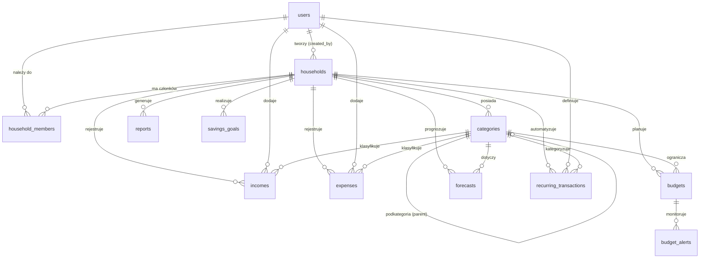
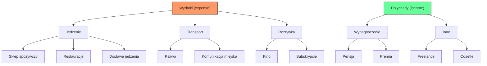

# Model logiczny bazy danych

## Spis treści

1. [Wprowadzenie](#wprowadzenie)
2. [Opis tabel](#opis-tabel)
   - [users — Użytkownicy](#users--użytkownicy)
   - [households — Gospodarstwa domowe](#households--gospodarstwa-domowe)
   - [household_members — Członkowie gospodarstw](#household_members--członkowie-gospodarstw)
   - [categories — Kategorie finansowe](#categories--kategorie-finansowe)
   - [incomes — Przychody](#incomes--przychody)
   - [expenses — Wydatki](#expenses--wydatki)
   - [budgets — Budżety miesięczne](#budgets--budżety-miesięczne)
   - [reports — Raporty](#reports--raporty)
   - [forecasts — Prognozy](#forecasts--prognozy)
   - [savings_goals — Cele oszczędnościowe](#savings_goals--cele-oszczędnościowe)
   - [recurring_transactions — Transakcje cykliczne](#recurring_transactions--transakcje-cykliczne)
   - [budget_alerts — Alerty budżetowe](#budget_alerts--alerty-budżetowe)
3. [Relacje między tabelami](#relacje-między-tabelami)
   - [Diagram relacji](#diagram-relacji)
   - [Lista relacji](#lista-relacji)
4. [Dowód zgodności z 3NF](#dowód-zgodności-z-3nf)
5. [Uwagi dotyczące hierarchii kategorii](#uwagi-dotyczące-hierarchii-kategorii)

---

## Wprowadzenie

Niniejszy dokument opisuje **model logiczny** bazy danych systemu zarządzania budżetem domowym. Wszystkie tabele należą do schematu `budget` i zostały zaprojektowane zgodnie z **trzecią postacią normalną (3NF)**.

Dokument zawiera:
- szczegółowy opis kolumn każdej tabeli (typ logiczny, dopuszczalność NULL, klucze, ograniczenia),
- listę wszystkich relacji między tabelami z określeniem krotności,
- dowód zgodności każdej tabeli z 1NF, 2NF i 3NF,
- uwagi dotyczące hierarchicznej struktury kategorii (self-referencing FK).

> [!NOTE]
> Konwencje nazewnictwa opisane są w pliku `conventions.md`. Wszystkie nazwy tabel i kolumn są w języku angielskim, w konwencji `snake_case`.

---

## Opis tabel

### `users` — Użytkownicy

Tabela przechowuje dane kont użytkowników systemu. Każdy użytkownik posiada unikalny adres e-mail i może należeć do wielu gospodarstw domowych.

| Kolumna | Typ logiczny | NULL? | Klucz | Opis |
|---------|-------------|-------|-------|------|
| `id` | SERIAL (INT) | NOT NULL | PK | Unikalny identyfikator użytkownika, generowany automatycznie |
| `email` | TEXT | NOT NULL | UNIQUE | Adres e-mail użytkownika, służy do logowania |
| `password_hash` | TEXT | NOT NULL | — | Hash hasła (pgcrypto), nigdy nie przechowujemy hasła w postaci jawnej |
| `display_name` | TEXT | NOT NULL | — | Nazwa wyświetlana użytkownika w interfejsie |
| `created_at` | TIMESTAMPTZ | NOT NULL | — | Data i czas utworzenia konta, domyślnie `NOW()` |

---

### `households` — Gospodarstwa domowe

Tabela przechowuje informacje o gospodarstwach domowych. Gospodarstwo jest podstawową jednostką organizacyjną — grupą osób współdzielących budżet.

| Kolumna | Typ logiczny | NULL? | Klucz | Opis |
|---------|-------------|-------|-------|------|
| `id` | SERIAL (INT) | NOT NULL | PK | Unikalny identyfikator gospodarstwa |
| `name` | TEXT | NOT NULL | — | Nazwa gospodarstwa domowego (np. „Rodzina Kowalskich") |
| `created_by` | INT | NOT NULL | FK → `users.id` | Użytkownik, który utworzył gospodarstwo |
| `created_at` | TIMESTAMPTZ | NOT NULL | — | Data i czas utworzenia gospodarstwa, domyślnie `NOW()` |

---

### `household_members` — Członkowie gospodarstw

Tabela realizuje relację wiele-do-wielu między użytkownikami a gospodarstwami domowymi. Każdy rekord przypisuje użytkownika do gospodarstwa z określoną rolą.

| Kolumna | Typ logiczny | NULL? | Klucz | Opis |
|---------|-------------|-------|-------|------|
| `id` | SERIAL (INT) | NOT NULL | PK | Unikalny identyfikator członkostwa |
| `household_id` | INT | NOT NULL | FK → `households.id` | Gospodarstwo domowe, do którego należy użytkownik |
| `user_id` | INT | NOT NULL | FK → `users.id` | Użytkownik będący członkiem gospodarstwa |
| `role` | TEXT | NOT NULL | — | Rola w gospodarstwie: `'owner'`, `'member'` lub `'viewer'` (CHECK) |
| `joined_at` | TIMESTAMPTZ | NOT NULL | — | Data i czas dołączenia do gospodarstwa, domyślnie `NOW()` |

**Ograniczenie UNIQUE:** `(household_id, user_id)` — użytkownik może być członkiem danego gospodarstwa tylko raz.

---

### `categories` — Kategorie finansowe

Tabela przechowuje kategorie i podkategorie finansowe. Dwupoziomowa hierarchia jest realizowana za pomocą klucza obcego wskazującego na tę samą tabelę (*self-referencing FK*).

| Kolumna | Typ logiczny | NULL? | Klucz | Opis |
|---------|-------------|-------|-------|------|
| `id` | SERIAL (INT) | NOT NULL | PK | Unikalny identyfikator kategorii |
| `household_id` | INT | NULL | FK → `households.id` | Gospodarstwo właściciela kategorii; `NULL` oznacza kategorię systemową (predefiniowaną) |
| `name` | TEXT | NOT NULL | — | Nazwa kategorii (np. „Jedzenie", „Transport") |
| `type` | TEXT | NOT NULL | — | Typ kategorii: `'income'` lub `'expense'` (CHECK) |
| `parent_category_id` | INT | NULL | FK → `categories.id` | Kategoria nadrzędna; `NULL` oznacza kategorię główną (najwyższy poziom) |
| `icon` | TEXT | NULL | — | Opcjonalna ikona/emoji reprezentująca kategorię |
| `created_at` | TIMESTAMPTZ | NOT NULL | — | Data i czas utworzenia kategorii, domyślnie `NOW()` |

> [!IMPORTANT]
> Kolumna `parent_category_id` jest kluczem obcym wskazującym na `categories.id` — ta sama tabela. Pozwala to na tworzenie dwupoziomowej hierarchii kategorii (kategoria → podkategoria). Szczegóły opisano w sekcji [Uwagi dotyczące hierarchii kategorii](#uwagi-dotyczące-hierarchii-kategorii).

---

### `incomes` — Przychody

Tabela rejestruje wpływy finansowe do gospodarstwa domowego. Każdy przychód jest przypisany do konkretnego użytkownika, gospodarstwa i kategorii.

| Kolumna | Typ logiczny | NULL? | Klucz | Opis |
|---------|-------------|-------|-------|------|
| `id` | SERIAL (INT) | NOT NULL | PK | Unikalny identyfikator przychodu |
| `household_id` | INT | NOT NULL | FK → `households.id` | Gospodarstwo domowe, do którego należy przychód |
| `user_id` | INT | NOT NULL | FK → `users.id` | Użytkownik, który zarejestrował przychód |
| `category_id` | INT | NOT NULL | FK → `categories.id` | Kategoria przychodu (musi być typu `'income'`) |
| `amount` | NUMERIC | NOT NULL | — | Kwota przychodu, musi być dodatnia (`CHECK amount > 0`) |
| `description` | TEXT | NULL | — | Opcjonalny opis przychodu (np. „Premia kwartalna") |
| `income_date` | DATE | NOT NULL | — | Data uzyskania przychodu |
| `created_at` | TIMESTAMPTZ | NOT NULL | — | Data i czas rejestracji wpisu, domyślnie `NOW()` |

---

### `expenses` — Wydatki

Tabela rejestruje wydatki z gospodarstwa domowego. Struktura analogiczna do tabeli `incomes`.

| Kolumna | Typ logiczny | NULL? | Klucz | Opis |
|---------|-------------|-------|-------|------|
| `id` | SERIAL (INT) | NOT NULL | PK | Unikalny identyfikator wydatku |
| `household_id` | INT | NOT NULL | FK → `households.id` | Gospodarstwo domowe, do którego należy wydatek |
| `user_id` | INT | NOT NULL | FK → `users.id` | Użytkownik, który zarejestrował wydatek |
| `category_id` | INT | NOT NULL | FK → `categories.id` | Kategoria wydatku (musi być typu `'expense'`) |
| `amount` | NUMERIC | NOT NULL | — | Kwota wydatku, musi być dodatnia (`CHECK amount > 0`) |
| `description` | TEXT | NULL | — | Opcjonalny opis wydatku (np. „Zakupy w Biedronce") |
| `expense_date` | DATE | NOT NULL | — | Data poniesienia wydatku |
| `created_at` | TIMESTAMPTZ | NOT NULL | — | Data i czas rejestracji wpisu, domyślnie `NOW()` |

---

### `budgets` — Budżety miesięczne

Tabela przechowuje planowane limity wydatków na poszczególne kategorie w danym miesiącu i roku.

| Kolumna | Typ logiczny | NULL? | Klucz | Opis |
|---------|-------------|-------|-------|------|
| `id` | SERIAL (INT) | NOT NULL | PK | Unikalny identyfikator budżetu |
| `household_id` | INT | NOT NULL | FK → `households.id` | Gospodarstwo domowe |
| `category_id` | INT | NOT NULL | FK → `categories.id` | Kategoria, na którą wyznaczono limit |
| `month` | INT | NOT NULL | — | Miesiąc (1–12), ograniczenie `CHECK (month BETWEEN 1 AND 12)` |
| `year` | INT | NOT NULL | — | Rok, ograniczenie `CHECK (year > 2000)` |
| `planned_amount` | NUMERIC | NOT NULL | — | Planowana kwota na daną kategorię, `CHECK (planned_amount > 0)` |
| `created_at` | TIMESTAMPTZ | NOT NULL | — | Data i czas utworzenia wpisu, domyślnie `NOW()` |

**Ograniczenie UNIQUE:** `(household_id, category_id, month, year)` — dla danego gospodarstwa, kategorii i okresu może istnieć tylko jeden budżet.

---

### `reports` — Raporty

Tabela przechowuje wygenerowane podsumowania finansowe za określone okresy rozliczeniowe.

| Kolumna | Typ logiczny | NULL? | Klucz | Opis |
|---------|-------------|-------|-------|------|
| `id` | SERIAL (INT) | NOT NULL | PK | Unikalny identyfikator raportu |
| `household_id` | INT | NOT NULL | FK → `households.id` | Gospodarstwo domowe, którego dotyczy raport |
| `period_start` | DATE | NOT NULL | — | Data rozpoczęcia okresu raportowania |
| `period_end` | DATE | NOT NULL | — | Data zakończenia okresu raportowania |
| `total_income` | NUMERIC | NOT NULL | — | Łączna suma przychodów w okresie |
| `total_expense` | NUMERIC | NOT NULL | — | Łączna suma wydatków w okresie |
| `balance` | NUMERIC | NOT NULL | — | Bilans (przychody − wydatki) |
| `generated_at` | TIMESTAMPTZ | NOT NULL | — | Data i czas wygenerowania raportu, domyślnie `NOW()` |

> [!NOTE]
> Kolumna `balance` przechowuje wartość obliczoną w momencie generowania raportu. Jest zapisywana jawnie, aby zachować historyczny wynik raportu nawet jeśli dane źródłowe zostaną później zmodyfikowane. Nie jest to zależność przechodnia — to „snapshot" stanu danych.

---

### `forecasts` — Prognozy

Tabela przechowuje prognozy wydatków na przyszłe okresy, obliczane na podstawie danych historycznych.

| Kolumna | Typ logiczny | NULL? | Klucz | Opis |
|---------|-------------|-------|-------|------|
| `id` | SERIAL (INT) | NOT NULL | PK | Unikalny identyfikator prognozy |
| `household_id` | INT | NOT NULL | FK → `households.id` | Gospodarstwo domowe |
| `category_id` | INT | NOT NULL | FK → `categories.id` | Kategoria, dla której obliczono prognozę |
| `month` | INT | NOT NULL | — | Prognozowany miesiąc (1–12) |
| `year` | INT | NOT NULL | — | Prognozowany rok |
| `predicted_amount` | NUMERIC | NOT NULL | — | Prognozowana kwota wydatków |
| `method` | TEXT | NOT NULL | — | Metoda prognozy, domyślnie `'moving_average'` |
| `created_at` | TIMESTAMPTZ | NOT NULL | — | Data i czas utworzenia prognozy, domyślnie `NOW()` |

---

### `savings_goals` — Cele oszczędnościowe

Tabela przechowuje cele finansowe gospodarstwa domowego z docelową kwotą, aktualnym postępem i terminem realizacji.

| Kolumna | Typ logiczny | NULL? | Klucz | Opis |
|---------|-------------|-------|-------|------|
| `id` | SERIAL (INT) | NOT NULL | PK | Unikalny identyfikator celu |
| `household_id` | INT | NOT NULL | FK → `households.id` | Gospodarstwo domowe |
| `name` | TEXT | NOT NULL | — | Nazwa celu (np. „Wakacje 2026", „Nowy laptop") |
| `target_amount` | NUMERIC | NOT NULL | — | Kwota docelowa, `CHECK (target_amount > 0)` |
| `current_amount` | NUMERIC | NOT NULL | — | Aktualnie zaoszczędzona kwota, domyślnie `0`, `CHECK (current_amount >= 0)` |
| `deadline` | DATE | NULL | — | Opcjonalny termin realizacji celu |
| `status` | TEXT | NOT NULL | — | Status celu: `'active'`, `'completed'` lub `'cancelled'` (CHECK), domyślnie `'active'` |
| `created_at` | TIMESTAMPTZ | NOT NULL | — | Data i czas utworzenia celu, domyślnie `NOW()` |

---

### `recurring_transactions` — Transakcje cykliczne

Tabela przechowuje wzorce transakcji powtarzających się automatycznie w określonych odstępach czasu.

| Kolumna | Typ logiczny | NULL? | Klucz | Opis |
|---------|-------------|-------|-------|------|
| `id` | SERIAL (INT) | NOT NULL | PK | Unikalny identyfikator wzorca |
| `household_id` | INT | NOT NULL | FK → `households.id` | Gospodarstwo domowe |
| `user_id` | INT | NOT NULL | FK → `users.id` | Użytkownik tworzący wzorzec |
| `category_id` | INT | NOT NULL | FK → `categories.id` | Kategoria transakcji |
| `type` | TEXT | NOT NULL | — | Typ transakcji: `'income'` lub `'expense'` (CHECK) |
| `amount` | NUMERIC | NOT NULL | — | Kwota transakcji, `CHECK (amount > 0)` |
| `description` | TEXT | NULL | — | Opcjonalny opis (np. „Czynsz za mieszkanie") |
| `frequency` | TEXT | NOT NULL | — | Częstotliwość: `'daily'`, `'weekly'`, `'monthly'` lub `'yearly'` (CHECK) |
| `next_execution_date` | DATE | NOT NULL | — | Data najbliższego planowanego wykonania |
| `is_active` | BOOLEAN | NOT NULL | — | Czy wzorzec jest aktywny, domyślnie `TRUE` |
| `created_at` | TIMESTAMPTZ | NOT NULL | — | Data i czas utworzenia wzorca, domyślnie `NOW()` |

---

### `budget_alerts` — Alerty budżetowe

Tabela przechowuje konfigurację alertów budżetowych. Alert jest wyzwalany automatycznie gdy wydatki przekroczą określony procent zaplanowanego budżetu.

| Kolumna | Typ logiczny | NULL? | Klucz | Opis |
|---------|-------------|-------|-------|------|
| `id` | SERIAL (INT) | NOT NULL | PK | Unikalny identyfikator alertu |
| `budget_id` | INT | NOT NULL | FK → `budgets.id` | Budżet, którego dotyczy alert |
| `threshold_percent` | NUMERIC | NOT NULL | — | Próg procentowy wyzwolenia alertu (0–100), `CHECK (threshold_percent BETWEEN 0 AND 100)` |
| `is_triggered` | BOOLEAN | NOT NULL | — | Czy alert został wyzwolony, domyślnie `FALSE` |
| `triggered_at` | TIMESTAMPTZ | NULL | — | Data i czas wyzwolenia alertu; `NULL` gdy jeszcze nie wyzwolony |
| `created_at` | TIMESTAMPTZ | NOT NULL | — | Data i czas utworzenia alertu, domyślnie `NOW()` |

---

## Relacje między tabelami

### Diagram relacji



### Lista relacji

Poniżej przedstawiono wszystkie relacje między tabelami z określeniem krotności i kolumny klucza obcego.

#### Relacje tabeli `users`

| Tabela nadrzędna | Krotność | Tabela podrzędna | Kolumna FK | Opis |
|-----------------|----------|-----------------|------------|------|
| `users` | 1 → N | `households` | `created_by` | Użytkownik może utworzyć wiele gospodarstw domowych |
| `users` | 1 → N | `household_members` | `user_id` | Użytkownik może być członkiem wielu gospodarstw |
| `users` | 1 → N | `incomes` | `user_id` | Użytkownik może zarejestrować wiele przychodów |
| `users` | 1 → N | `expenses` | `user_id` | Użytkownik może zarejestrować wiele wydatków |
| `users` | 1 → N | `recurring_transactions` | `user_id` | Użytkownik może zdefiniować wiele transakcji cyklicznych |

#### Relacje tabeli `households`

| Tabela nadrzędna | Krotność | Tabela podrzędna | Kolumna FK | Opis |
|-----------------|----------|-----------------|------------|------|
| `households` | 1 → N | `household_members` | `household_id` | Gospodarstwo ma wielu członków |
| `households` | 1 → N | `categories` | `household_id` | Gospodarstwo posiada własne kategorie (NULL = systemowe) |
| `households` | 1 → N | `incomes` | `household_id` | Gospodarstwo rejestruje wiele przychodów |
| `households` | 1 → N | `expenses` | `household_id` | Gospodarstwo rejestruje wiele wydatków |
| `households` | 1 → N | `budgets` | `household_id` | Gospodarstwo planuje wiele budżetów |
| `households` | 1 → N | `reports` | `household_id` | Gospodarstwo ma wiele raportów |
| `households` | 1 → N | `forecasts` | `household_id` | Gospodarstwo ma wiele prognoz |
| `households` | 1 → N | `savings_goals` | `household_id` | Gospodarstwo realizuje wiele celów oszczędnościowych |
| `households` | 1 → N | `recurring_transactions` | `household_id` | Gospodarstwo posiada wiele transakcji cyklicznych |

#### Relacje tabeli `categories`

| Tabela nadrzędna | Krotność | Tabela podrzędna | Kolumna FK | Opis |
|-----------------|----------|-----------------|------------|------|
| `categories` | 1 → N | `categories` | `parent_category_id` | Kategoria nadrzędna może mieć wiele podkategorii (self-referencing) |
| `categories` | 1 → N | `incomes` | `category_id` | Kategoria klasyfikuje wiele przychodów |
| `categories` | 1 → N | `expenses` | `category_id` | Kategoria klasyfikuje wiele wydatków |
| `categories` | 1 → N | `budgets` | `category_id` | Kategoria może mieć wiele budżetów (w różnych okresach) |
| `categories` | 1 → N | `forecasts` | `category_id` | Kategoria może mieć wiele prognoz |
| `categories` | 1 → N | `recurring_transactions` | `category_id` | Kategoria klasyfikuje wiele transakcji cyklicznych |

#### Relacje tabeli `budgets`

| Tabela nadrzędna | Krotność | Tabela podrzędna | Kolumna FK | Opis |
|-----------------|----------|-----------------|------------|------|
| `budgets` | 1 → N | `budget_alerts` | `budget_id` | Budżet może mieć wiele alertów (z różnymi progami) |

#### Relacja wiele-do-wielu: `users` ↔ `households`

Relacja wiele-do-wielu między użytkownikami a gospodarstwami domowymi jest realizowana przez tabelę asocjacyjną `household_members`:

- Jeden użytkownik (`users`) może należeć do wielu gospodarstw (`households`)
- Jedno gospodarstwo (`households`) może mieć wielu członków (`users`)
- Constraint `UNIQUE(household_id, user_id)` zapobiega duplikatom

---

## Dowód zgodności z 3NF

Każda tabela w schemacie `budget` została zaprojektowana w trzeciej postaci normalnej (3NF). Poniżej przedstawiono dowód dla każdej tabeli.

### `users`

- **1NF** ✔️ — Wszystkie kolumny przechowują wartości atomowe (email, password_hash, display_name to pojedyncze wartości tekstowe). Brak powtarzających się grup.
- **2NF** ✔️ — Klucz główny to pojedyncza kolumna `id`. Wszystkie atrybuty nieklucowe (`email`, `password_hash`, `display_name`, `created_at`) zależą od całego klucza głównego.
- **3NF** ✔️ — Brak zależności przechodnich. Kolumna `email` jest niezależna od `display_name`, `password_hash` nie wynika z żadnego innego atrybutu. Żaden atrybut nieklucowy nie zależy od innego atrybutu nieklucowego.

### `households`

- **1NF** ✔️ — Wartości atomowe, brak powtarzających się grup.
- **2NF** ✔️ — Klucz główny `id` jest pojedynczy. `name`, `created_by` i `created_at` zależą bezpośrednio od `id`.
- **3NF** ✔️ — Brak zależności przechodnich. Kolumna `created_by` jest referencją FK do `users.id` — przechowuje jedynie identyfikator twórcy, nie przechowuje danych użytkownika (np. imienia). Kolumna `name` nie zależy od `created_by`.

### `household_members`

- **1NF** ✔️ — Wartości atomowe, brak powtarzających się grup. Rola to pojedyncza wartość tekstowa z ograniczonego zbioru.
- **2NF** ✔️ — Klucz główny `id` jest pojedynczy (surrogate key). Wszystkie atrybuty (`household_id`, `user_id`, `role`, `joined_at`) zależą od `id`.
- **3NF** ✔️ — Brak zależności przechodnich. Kolumna `role` nie wynika z `household_id` ani `user_id` — ta sama osoba może mieć różne role w różnych gospodarstwach. Żaden atrybut nieklucowy nie determinuje innego atrybutu nieklucowego.

### `categories`

- **1NF** ✔️ — Wartości atomowe, brak powtarzających się grup. Kolumna `icon` przechowuje pojedynczą wartość tekstową.
- **2NF** ✔️ — Klucz główny `id` jest pojedynczy. Wszystkie atrybuty nieklucowe zależą od `id`.
- **3NF** ✔️ — Brak zależności przechodnich. Kolumna `type` nie wynika z `name` (różne kategorie o różnych nazwach mogą być tego samego typu). Kolumna `parent_category_id` jest referencją FK — przechowuje jedynie identyfikator rodzica, nie duplikuje danych kategorii nadrzędnej (nazwa, typ rodzica nie są przechowywane). Kolumna `household_id` jest niezależna od pozostałych atrybutów.

### `incomes`

- **1NF** ✔️ — Wartości atomowe, brak powtarzających się grup.
- **2NF** ✔️ — Klucz główny `id` jest pojedynczy. Atrybuty `household_id`, `user_id`, `category_id`, `amount`, `description`, `income_date` i `created_at` zależą od `id`.
- **3NF** ✔️ — Brak zależności przechodnich. Kolumny `amount`, `description` i `income_date` zależą bezpośrednio od `id` (PK), nie od siebie nawzajem. Kolumny `household_id`, `user_id` i `category_id` to referencje FK — przechowują jedynie identyfikatory, nie duplikują danych z tabel nadrzędnych (np. nazwa gospodarstwa ani nazwa kategorii nie są przechowywane w tej tabeli).

### `expenses`

- **1NF** ✔️ — Wartości atomowe, brak powtarzających się grup.
- **2NF** ✔️ — Klucz główny `id` jest pojedynczy. Wszystkie atrybuty nieklucowe zależą od `id`.
- **3NF** ✔️ — Brak zależności przechodnich. Kolumny `amount`, `description` i `expense_date` zależą bezpośrednio od `id` (PK), a nie od siebie nawzajem — kwota nie determinuje daty, opis nie determinuje kwoty. Kolumny `household_id`, `user_id` i `category_id` to referencje FK przechowujące jedynie identyfikatory, nie wartości pochodne.

### `budgets`

- **1NF** ✔️ — Wartości atomowe, brak powtarzających się grup. Miesiąc i rok to osobne kolumny liczbowe.
- **2NF** ✔️ — Klucz główny `id` jest pojedynczy. Wszystkie atrybuty nieklucowe zależą od `id`.
- **3NF** ✔️ — Brak zależności przechodnich. Kolumna `planned_amount` nie wynika z `month` i `year` (różne okresy mogą mieć różne kwoty). Kolumny `household_id` i `category_id` to referencje FK. Kolumny `month` i `year` nie determinują siebie nawzajem ani nie determinują `planned_amount` — ten sam miesiąc w różnych latach może mieć inny limit.

### `reports`

- **1NF** ✔️ — Wartości atomowe, brak powtarzających się grup.
- **2NF** ✔️ — Klucz główny `id` jest pojedynczy. Wszystkie atrybuty nieklucowe zależą od `id`.
- **3NF** ✔️ — Kolumna `balance` jest wartością obliczaną (`total_income - total_expense`), co mogłoby sugerować zależność przechodnią. Jednak `balance` jest celowo przechowywany jako **snapshot historyczny** — wartość obliczona w momencie generowania raportu. Nawet jeśli dane źródłowe (przychody, wydatki) zostaną później zmienione, raport zachowuje swój oryginalny wynik. Dlatego `balance` nie jest zależnością przechodnią — jest niezależnym atrybutem raportu, analogicznym do „wersji utrwalonej".

### `forecasts`

- **1NF** ✔️ — Wartości atomowe, brak powtarzających się grup.
- **2NF** ✔️ — Klucz główny `id` jest pojedynczy. Wszystkie atrybuty nieklucowe zależą od `id`.
- **3NF** ✔️ — Brak zależności przechodnich. Kolumna `predicted_amount` nie wynika z `method` — ta sama metoda może dawać różne wyniki dla różnych kategorii i okresów. Kolumna `method` nie determinuje `predicted_amount` ani odwrotnie. Kolumny `household_id` i `category_id` to referencje FK.

### `savings_goals`

- **1NF** ✔️ — Wartości atomowe, brak powtarzających się grup.
- **2NF** ✔️ — Klucz główny `id` jest pojedynczy. Wszystkie atrybuty nieklucowe zależą od `id`.
- **3NF** ✔️ — Brak zależności przechodnich. Kolumna `status` nie wynika bezpośrednio z `current_amount` i `target_amount` — zmiana statusu na `'completed'` następuje przez wyzwalacz, ale status jest niezależnym atrybutem (może być też `'cancelled'` niezależnie od kwot). Kolumna `current_amount` nie determinuje `target_amount` ani odwrotnie. Kolumna `deadline` jest niezależna od pozostałych atrybutów.

### `recurring_transactions`

- **1NF** ✔️ — Wartości atomowe, brak powtarzających się grup.
- **2NF** ✔️ — Klucz główny `id` jest pojedynczy. Wszystkie atrybuty nieklucowe zależą od `id`.
- **3NF** ✔️ — Brak zależności przechodnich. Kolumna `type` nie wynika z `category_id` (typ jest jawnie podany, choć kategoria ma swój typ — jest to celowa redundancja walidacyjna). Kolumna `frequency` nie determinuje `amount` ani `next_execution_date`. Kolumna `is_active` jest niezależna od pozostałych atrybutów — wzorzec może być dezaktywowany niezależnie od jego parametrów. Kolumny `household_id`, `user_id` i `category_id` to referencje FK.

### `budget_alerts`

- **1NF** ✔️ — Wartości atomowe, brak powtarzających się grup.
- **2NF** ✔️ — Klucz główny `id` jest pojedynczy. Wszystkie atrybuty nieklucowe zależą od `id`.
- **3NF** ✔️ — Brak zależności przechodnich. Kolumny `threshold_percent` i `is_triggered` zależą bezpośrednio od `id` alertu, nie od danych budżetu. Kolumna `triggered_at` nie determinuje `is_triggered` w sensie logicznym modelu — to wyzwalacz ustawia obie wartości jednocześnie, ale nie ma między nimi zależności funkcyjnej (alert mógłby być teoretycznie wyzwolony bez zapisu daty). Kolumna `budget_id` to referencja FK — przechowuje jedynie identyfikator, nie duplikuje danych budżetu (np. `planned_amount`).

---

## Uwagi dotyczące hierarchii kategorii

Tabela `categories` wykorzystuje **self-referencing foreign key** (klucz obcy wskazujący na tę samą tabelę) w kolumnie `parent_category_id`. Umożliwia to utworzenie dwupoziomowej hierarchii kategorii:

```
Kategoria główna (parent_category_id = NULL)
├── Podkategoria 1 (parent_category_id = id kategorii głównej)
├── Podkategoria 2 (parent_category_id = id kategorii głównej)
└── Podkategoria 3 (parent_category_id = id kategorii głównej)
```

### Zasady hierarchii

1. **Kategoria główna** — rekord z `parent_category_id = NULL`. Stanowi najwyższy poziom w drzewie.
2. **Podkategoria** — rekord z `parent_category_id` wskazującym na `id` kategorii głównej. Stanowi drugi (i ostatni) poziom.
3. **Ograniczenie do 2 poziomów** — system nie zezwala na tworzenie podkategorii podkategorii. Walidacja odbywa się na poziomie aplikacji lub wyzwalacza.
4. **Spójność typów** — podkategoria dziedziczy typ (`income`/`expense`) od kategorii nadrzędnej. Walidacja powinna zapewnić, że podkategoria ma ten sam typ co rodzic.

### Kategorie systemowe vs. użytkownika

| Cecha | Kategorie systemowe | Kategorie użytkownika |
|-------|--------------------|-----------------------|
| `household_id` | `NULL` | FK → `households.id` |
| Widoczność | Globalna — widoczne dla wszystkich gospodarstw | Lokalna — widoczne tylko w danym gospodarstwie |
| Edycja | Niedozwolona (chronione) | Dozwolona przez właściciela/członka |
| Przykłady | Jedzenie, Transport, Wynagrodzenie | „Kieszonkowe Kuby", „Remont łazienki" |

### Diagram hierarchii



---

> **Powiązane dokumenty:**
> - [Wymagania funkcjonalne](requirements.md) — pełna specyfikacja wymagań systemu
> - [Słownik pojęć](glossary.md) — definicje terminów domenowych
> - [Wymagania niefunkcjonalne](non-functional-requirements.md) — wymagania pozafunkcjonalne
