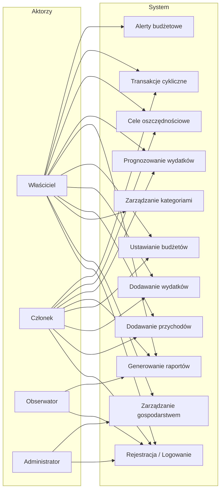

# Wymagania funkcjonalne

## Spis treści

1. [Wprowadzenie](#wprowadzenie)
2. [Aktorzy systemu](#aktorzy-systemu)
3. [Wymagania funkcjonalne](#wymagania-funkcjonalne-1)
   - [WF-01: Zarządzanie użytkownikami](#wf-01-zarządzanie-użytkownikami)
   - [WF-02: Gospodarstwa domowe](#wf-02-gospodarstwa-domowe)
   - [WF-03: Kategorie finansowe](#wf-03-kategorie-finansowe)
   - [WF-04: Przychody](#wf-04-przychody)
   - [WF-05: Wydatki](#wf-05-wydatki)
   - [WF-06: Budżety miesięczne](#wf-06-budżety-miesięczne)
   - [WF-07: Raporty](#wf-07-raporty)
   - [WF-08: Prognozy](#wf-08-prognozy)
   - [WF-09: Cele oszczędnościowe](#wf-09-cele-oszczędnościowe)
   - [WF-10: Transakcje cykliczne](#wf-10-transakcje-cykliczne)
   - [WF-11: Alerty budżetowe](#wf-11-alerty-budżetowe)
4. [Tabela podsumowująca](#tabela-podsumowująca)
5. [Diagram przypadków użycia](#diagram-przypadków-użycia)

---

## Wprowadzenie

Dokument opisuje wymagania funkcjonalne systemu zarządzania budżetem domowym. System umożliwia śledzenie przychodów i wydatków w ramach gospodarstwa domowego, planowanie budżetów, generowanie raportów i prognoz, oraz zarządzanie celami oszczędnościowymi.

**Priorytetyzacja MoSCoW:**
- **M** (Must have) — wymagane do działania systemu
- **S** (Should have) — ważne, planowane w pierwszej wersji
- **C** (Could have) — opcjonalne, jeśli starczy czasu
- **W** (Won't have) — poza zakresem projektu

---

## Aktorzy systemu

| Aktor | Opis | Rola w DB |
|-------|------|-----------|
| **Administrator** | Zarządza systemem, widzi wszystkie dane | `admin` |
| **Właściciel gospodarstwa** | Tworzy gospodarstwo, zaprasza członków, pełne uprawnienia | `household_member` (role = 'owner') |
| **Członek gospodarstwa** | Dodaje przychody/wydatki, widzi wspólne dane | `household_member` (role = 'member') |
| **Obserwator** | Tylko odczyt danych gospodarstwa | `household_member` (role = 'viewer') |

---

## Wymagania funkcjonalne

### WF-01: Zarządzanie użytkownikami

| Pole | Wartość |
|------|---------|
| **ID** | WF-01 |
| **Priorytet** | M (Must have) |
| **Aktorzy** | Wszyscy |

**Opis:**
System umożliwia rejestrację i uwierzytelnianie użytkowników.

**Szczegóły:**
- Rejestracja z email, hasłem i nazwą wyświetlaną
- Hasła przechowywane jako hash (pgcrypto)
- Jeden użytkownik może należeć do wielu gospodarstw domowych
- Każdy użytkownik ma unikalne `email`

**Tabela:** `budget.users`
| Kolumna | Opis |
|---------|------|
| id | Klucz główny (SERIAL) |
| email | Unikalny adres email |
| password_hash | Hash hasła (pgcrypto) |
| display_name | Nazwa wyświetlana |
| created_at | Data utworzenia konta |

---

### WF-02: Gospodarstwa domowe

| Pole | Wartość |
|------|---------|
| **ID** | WF-02 |
| **Priorytet** | M (Must have) |
| **Aktorzy** | Właściciel, Członek, Obserwator |

**Opis:**
Gospodarstwo domowe to grupa osób współdzielących budżet. Właściciel tworzy gospodarstwo i zaprasza członków z określonymi rolami.

**Szczegóły:**
- Właściciel tworzy gospodarstwo domowe
- Właściciel dodaje członków z rolą: `owner`, `member`, `viewer`
- Wszyscy członkowie widzą wspólne przychody i wydatki
- Użytkownik może należeć do wielu gospodarstw (np. rodzina + współlokatorzy)
- RLS zapewnia izolację danych między gospodarstwami

**Tabele:** `budget.households`, `budget.household_members`

---

### WF-03: Kategorie finansowe

| Pole | Wartość |
|------|---------|
| **ID** | WF-03 |
| **Priorytet** | M (Must have) |
| **Aktorzy** | Właściciel, Członek |

**Opis:**
Hierarchiczny system kategorii do klasyfikacji przychodów i wydatków. Dwupoziomowa hierarchia (kategoria → podkategoria).

**Szczegóły:**
- Dwa poziomy: kategoria główna i podkategoria
- Self-referencing FK (`parent_category_id`) — podkategoria wskazuje na rodzica
- Kategorie oznaczone typem: `income` (przychód) lub `expense` (wydatek)
- Predefiniowane kategorie systemowe (np. Jedzenie, Transport, Wynagrodzenie)
- Możliwość dodawania własnych kategorii per gospodarstwo
- Opcjonalna ikona/emoji dla kategorii

**Przykłady:**
```
Wydatki:
├── Jedzenie
│   ├── Sklep spożywczy
│   ├── Restauracje
│   └── Dostawa jedzenia
├── Transport
│   ├── Paliwo
│   ├── Komunikacja miejska
│   └── Serwis samochodu
└── Rozrywka
    ├── Kino
    └── Subskrypcje

Przychody:
├── Wynagrodzenie
│   ├── Pensja
│   └── Premia
└── Inne
    ├── Freelance
    └── Odsetki
```

**Tabela:** `budget.categories`

---

### WF-04: Przychody

| Pole | Wartość |
|------|---------|
| **ID** | WF-04 |
| **Priorytet** | M (Must have) |
| **Aktorzy** | Właściciel, Członek |

**Opis:**
Rejestracja wpływów finansowych do gospodarstwa domowego.

**Szczegóły:**
- Dodawanie przychodu z kwotą, kategorią, datą i opisem
- Przychód przypisany do użytkownika (kto dodał) i gospodarstwa
- Kategoria musi być typu `income`
- Kwota musi być dodatnia (`CHECK amount > 0`)
- Historia przychodów z możliwością filtrowania po dacie, kategorii, użytkowniku

**Tabela:** `budget.incomes`

---

### WF-05: Wydatki

| Pole | Wartość |
|------|---------|
| **ID** | WF-05 |
| **Priorytet** | M (Must have) |
| **Aktorzy** | Właściciel, Członek |

**Opis:**
Rejestracja wydatków z gospodarstwa domowego.

**Szczegóły:**
- Dodawanie wydatku z kwotą, kategorią, datą i opisem
- Wydatek przypisany do użytkownika (kto dodał) i gospodarstwa
- Kategoria musi być typu `expense`
- Kwota musi być dodatnia (`CHECK amount > 0`)
- Historia wydatków z możliwością filtrowania
- Po dodaniu wydatku — wyzwalacz sprawdza alerty budżetowe

**Tabela:** `budget.expenses`

---

### WF-06: Budżety miesięczne

| Pole | Wartość |
|------|---------|
| **ID** | WF-06 |
| **Priorytet** | M (Must have) |
| **Aktorzy** | Właściciel, Członek |

**Opis:**
Planowanie limitów wydatków na poszczególne kategorie w danym miesiącu.

**Szczegóły:**
- Ustawianie planowanej kwoty na kategorię w danym miesiącu/roku
- Jeden budżet per (gospodarstwo, kategoria, miesiąc, rok) — UNIQUE constraint
- Porównanie wydatków rzeczywistych z planowanymi
- Możliwość kopiowania budżetów z poprzedniego miesiąca (procedura)

**Tabela:** `budget.budgets`

---

### WF-07: Raporty

| Pole | Wartość |
|------|---------|
| **ID** | WF-07 |
| **Priorytet** | S (Should have) |
| **Aktorzy** | Właściciel, Członek, Obserwator |

**Opis:**
Automatycznie generowane podsumowania finansowe za określony okres.

**Szczegóły:**
- Raport zawiera: okres (od-do), łączne przychody, łączne wydatki, bilans
- Generowanie raportu przez procedurę składowaną
- Widok materializowany dla szybkiego dostępu do trendów
- Raport per gospodarstwo — izolacja RLS
- Typy raportów: miesięczny, kwartalny, roczny

**Tabela:** `budget.reports`

---

### WF-08: Prognozy

| Pole | Wartość |
|------|---------|
| **ID** | WF-08 |
| **Priorytet** | S (Should have) |
| **Aktorzy** | Właściciel, Członek |

**Opis:**
Przewidywanie przyszłych wydatków na podstawie danych historycznych.

**Szczegóły:**
- Prognoza per (gospodarstwo, kategoria, miesiąc, rok)
- Metoda: średnia krocząca z ostatnich N miesięcy (domyślnie 3)
- Funkcja PL/pgSQL obliczająca prognozę
- Porównanie prognozy z budżetem i rzeczywistymi wydatkami

**Tabela:** `budget.forecasts`

---

### WF-09: Cele oszczędnościowe

| Pole | Wartość |
|------|---------|
| **ID** | WF-09 |
| **Priorytet** | S (Should have) |
| **Aktorzy** | Właściciel, Członek |

**Opis:**
Definiowanie celów finansowych z docelową kwotą i terminem, śledzenie postępu przez ręczne wpłaty.

**Szczegóły:**
- Cel ma: nazwę, kwotę docelową, aktualną kwotę, termin, status
- Ręczne wpłaty na cel (dodawanie kwoty do `current_amount`)
- Status: `active`, `completed`, `cancelled`
- Obliczanie postępu procentowego (funkcja)
- Wyzwalacz: automatyczna zmiana statusu na `completed` gdy `current_amount >= target_amount`
- Cel przypisany do gospodarstwa domowego

**Tabela:** `budget.savings_goals`

---

### WF-10: Transakcje cykliczne

| Pole | Wartość |
|------|---------|
| **ID** | WF-10 |
| **Priorytet** | S (Should have) |
| **Aktorzy** | Właściciel, Członek |

**Opis:**
Definiowanie wzorców transakcji powtarzających się automatycznie (np. czynsz, pensja).

**Szczegóły:**
- Wzorzec zawiera: kwotę, kategorię, typ (income/expense), częstotliwość, datę następnego wykonania
- Częstotliwości: `daily`, `weekly`, `monthly`, `yearly`
- System automatycznie tworzy wpisy (income/expense) według wzorca
- Procedura do przetwarzania zaległych transakcji cyklicznych
- Możliwość aktywacji/dezaktywacji (`is_active`)
- Po utworzeniu wpisu — aktualizacja `next_execution_date`

**Tabela:** `budget.recurring_transactions`

---

### WF-11: Alerty budżetowe

| Pole | Wartość |
|------|---------|
| **ID** | WF-11 |
| **Priorytet** | C (Could have) |
| **Aktorzy** | Właściciel, Członek |

**Opis:**
Powiadomienia wyzwalane automatycznie gdy wydatki w kategorii przekroczą określony procent budżetu.

**Szczegóły:**
- Jeden konfigurowalny próg procentowy per budżet (np. 80%)
- Wyzwalacz na tabeli `expenses`: po INSERT sprawdza sumę wydatków vs budżet
- Jeśli suma wydatków > `threshold_percent * planned_amount / 100` → alert jest wyzwalany
- Alert zapisywany z datą wyzwolenia (`triggered_at`)
- Flaga `is_triggered` — alert wyzwalany tylko raz (nie powtarza się)

**Tabela:** `budget.budget_alerts`

---

## Tabela podsumowująca

| ID | Nazwa | Priorytet | Tabele DB |
|----|-------|-----------|-----------|
| WF-01 | Zarządzanie użytkownikami | M | `users` |
| WF-02 | Gospodarstwa domowe | M | `households`, `household_members` |
| WF-03 | Kategorie finansowe | M | `categories` |
| WF-04 | Przychody | M | `incomes` |
| WF-05 | Wydatki | M | `expenses` |
| WF-06 | Budżety miesięczne | M | `budgets` |
| WF-07 | Raporty | S | `reports` |
| WF-08 | Prognozy | S | `forecasts` |
| WF-09 | Cele oszczędnościowe | S | `savings_goals` |
| WF-10 | Transakcje cykliczne | S | `recurring_transactions` |
| WF-11 | Alerty budżetowe | C | `budget_alerts` |

---

## Diagram przypadków użycia



---

> **Uwaga:** Wszystkie tabele należą do schematu `budget`. Konwencje nazewnictwa opisane w `docs/conventions.md`.
>
> **Decyzje projektowe podjęte w tym dokumencie:**
> - Model gospodarstw domowych: współdzielony budżet, właściciel zaprasza członków
> - Hierarchia kategorii: 2 poziomy (kategoria → podkategoria, self-referencing FK)
> - Transakcje cykliczne: automatyczne tworzenie wpisów wg wzorca
> - Alerty budżetowe: jeden konfigurowalny próg per budżet
> - Cele oszczędnościowe: ręczne wpłaty na cel
